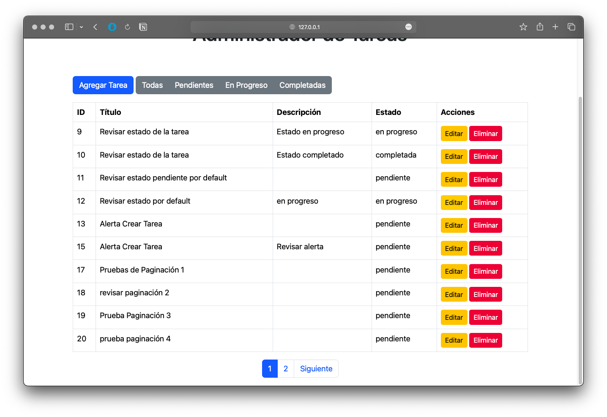

# Task Manager REST API

Este proyecto es una API REST para la gestión de tareas. Permite a los usuarios crear, leer, actualizar y eliminar tareas a través de endpoints HTTP.



## Tecnologías utilizadas
- Laravel 8.x
- PHP 7.4
- MySQL

## Instrucciones para ejecutar el proyecto

1. Clona el repositorio:
    ```bash
    git clone https://github.com/tu_usuario/TaskManagerRESTAPI.git
    ```
2. Navega al directorio del proyecto:
    ```bash
    cd TaskManagerRESTAPI
    ```
3. Instala las dependencias de Composer:
    ```bash
    composer install
    ```
4. Copia el archivo `.env.example` a `.env` y configura tus variables de entorno, incluyendo la conexión a la base de datos:
    ```bash
    cp .env.example .env
    ```
5. Genera la clave de la aplicación:
    ```bash
    php artisan key:generate
    ```
6. Ejecuta las migraciones para crear las tablas en la base de datos:
    ```bash
    php artisan migrate
    ```
7. Inicia el servidor de desarrollo:
    ```bash
    php artisan serve
    ```

## Información del proyecto
- **Versión de Laravel:** 8.x
- **Versión de PHP:** 7.4
- **Nombre de la base de datos:** task_manager_db